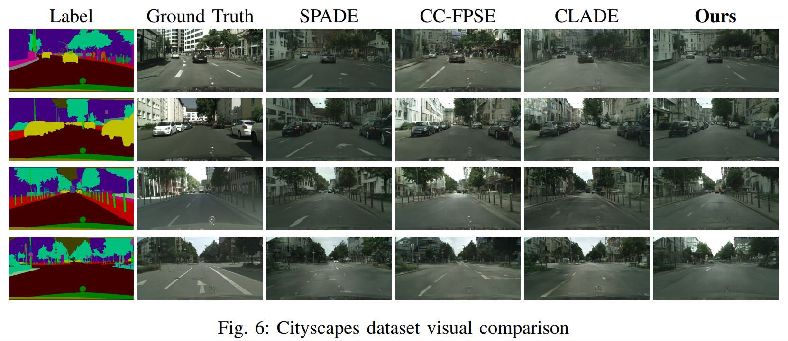

# Efficient Semantic Image Synthesis with Normalization Layers and Depth Estimation (UDGAN)

&nbsp;
## Full illustration of our Model 
  

&nbsp;

[Karim Magdy](https://scholar.google.com/citations?user=v4wnV7QAAAAJ), [Ghada Khoriba](https://scholar.google.com/citations?hl=en&user=jwTBsIIAAAAJ), [Hala Abbas](https://scholar.google.com/citations?hl=en&user=s8EB22cAAAAJ)

## Abstract

One of the most important tasks in image-to-image translation is semantic image synthesis. The success of Generative Adversarial Network (GAN) models for the synthesis of semantic images has increased, but the synthesized images produced by these models are of insufficient quality since they lack structural and spatial information. The unique approach we suggest in this paper is built on normalization layers and depth maps, which provide the textures and structure required for each object on the semantic map. First, we present a depth generator that generates a depth image map from the semantic image and then feeds the generated depth map into the normalization layers. Then, we develop a depth discriminator that distinguishes between the depth map of the real image and the depth-translated image generated by the global generator. We run our experiments on three benchmark datasets and achieve high robustness against state-of-the-art evaluation protocols used in semantic image synthesis tasks.

## Example Results
* **Cityscapes:**

  
  

## Prerequisites
- Linux
- Python 3
- CPU or NVIDIA GPU + CUDA CuDNN

## Dataset Preparation
The Cityscapes and ADE20K dataset can be downloaded and prepared following [SPADE](https://github.com/NVlabs/SPADE.git). 

#### Pretrained Models (to be updated)
Will update you soon... 

### Acknowledge
We acknowledge BA-HPC, The Bibliotheca Alexandrina High-Performance Computing, for their facility that offers us merit-based access to a High-Performance Computing cluster to conduct our experiments. Also, This code borrows heavily from SPADE. 
 
